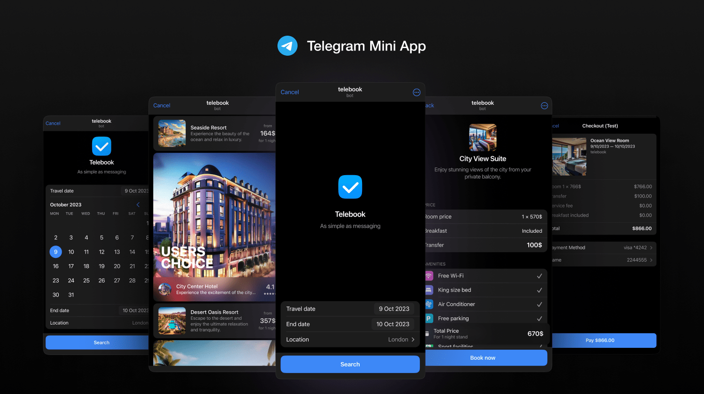

# Telebook

Telegram Mini Application for booking hotels *

  <a href="https://t.me/tebook_bot/telebook">
    <picture>
      <source media="(prefers-color-scheme: dark)"  srcset="./docs/assets/cover.png">
      <source media="(prefers-color-scheme: light)" srcset="./docs/assets/cover-light.png">
      
    </picture>
  </a>

 <a href="https://t.me/tebook_bot/telebook">@tebook_bot/telebook</a> |
  <a href="https://core.telegram.org/bots/webapps">Telegram Mini Apps</a> |
  <a href="#how-to-use-repo">Documentation</a>

* — it's just a demonstration of [Telegram Mini Apps](https://core.telegram.org/bots/webapps) platform. No real hotels and payments.

Use this project as an example or template for the creation of your app:

1. 🧩 Telegram UI Kit — build native-like interfaces with ready-to-use components
2. ✨ Advanced DX — fast build, modern code style and linters, well-documented code
3. 💎 Clean but simple architecture — easy to scale and maintain
4. 📦 Production-ready deployment setup
5. 💵 Payments support

## 👋 About the example

Telebook — is a kind of booking app that runs inside the Telegram. It provides several screens demonstrating different abilities: list views, cards, animations, forms, payments, etc.

It uses mocked data:
- Cities available for search
- Hotels
- Rooms
- Reviews
- All mock pictures are generated using [Shedevrum AI](https://shedevrum.ai)

It uses following Telegram Web App features:

- [ThemeParams](https://core.telegram.org/bots/webapps#themeparams)
- [Payments API](https://core.telegram.org/bots/payments)
- [MainButton](https://core.telegram.org/bots/webapps#mainbutton) and [BackButton](https://core.telegram.org/bots/webapps#backbutton)
- and other

## 📖 How to use repo

Use following instructions

- [Frontend tech guide](./client/README.md)
- [Backend tech guide](./server/README.md)
- [How to setup Payments](./docs/Payments.md)

