# Telegram Vue UI Kit

The collection of ready-to-use components that could be used to create native-like views that will look perfect on iOS, Android and other devices

Built with respect to:

- [Telegram community UI Library](https://www.figma.com/@firststagelabs) — basic design system for iOS and Android
- Apple Design Resources and guidelines
- Material Design System
- Telegram WebK design
- Telegram Desktop design

## Table of content

- [Amount](#amount)
- [Avatar](#avatar)
- [DataOverview](#dataoverview)
- [DatePicker](#datepicker)
- [DatePickerCompact ](#datepickercompact)
- [Icon](#icon)
- [Input](#input)
- [List](#list)
- [ListItem](#listitem)
- [ListCard](#listcard)
- [ListItemExpandable](#listitemexpandable)
- [Lottie](#lottie)
- [FixedFooter](#fixedfooter)
- [PageWithHeader](#pagewithheader)
- [Placeholder](#placeholder)
- [Rating](#rating)
- [Section](#section)
- [Sections](#sections)
- [Text](#text)

## Amount

Amount component is used to display a number with optional prefix and postfix.

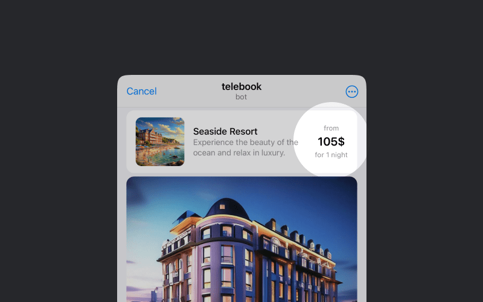

### Props

| Prop name | Type | Default value | Description |
| --------- | ---- | ------------- | ----------- |
| `prefix` | `string` | `undefined` | Will be placed at top-left corner near the number |

### Slots

| Slot name | Description |
| --------- | ----------- |
| `default` | Number itself |
| `topline` | Will be placed above the number |
| `postfix` | Will be placed after the number |
| `subline` | Will be placed below the number |

## Avatar

Avatar component is used to display a picture or a placeholder.

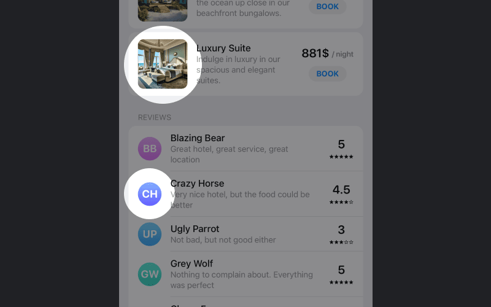

### Props

| Prop name | Type | Default value | Description |
| --------- | ---- | ------------- | ----------- |
| `id` | `number` | `undefined` | Entity ID |
| `src` | `string` | `undefined` | Picture src |
| `pictureThumb` | `string` | `undefined` | Base64 of picture 10x10 used as thumbnail |
| `placeholder` | `string` | `undefined` | Used when the image is not available |
| `big` | `boolean` | `undefined` | Whether the avatar should be big |

## DataOverview

DataOverview component is used to display rating, awards and charts place.

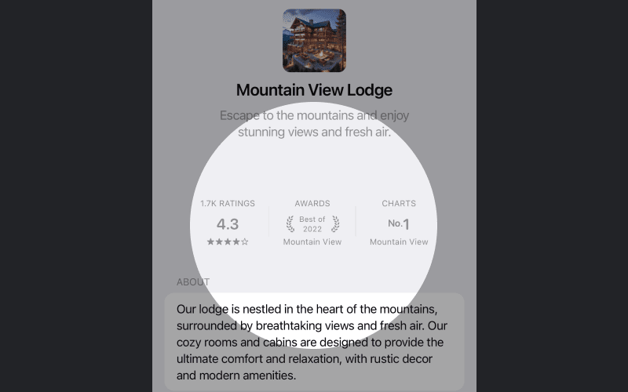

### Props

| Prop name | Type | Default value | Description |
| --------- | ---- | ------------- | ----------- |
| rating | [Rating](#rating) | - | Rating data |
| award | [Award](#award) | - | Award data |
| chart | [Chart](#chart) | - | Chart data |

### Types

#### Rating

| Property name | Type | Description |
| ------------- | ---- | ----------- |
| rating | number | Rating value |
| votesCount | number | Number of votes |

#### Award

| Property name | Type | Description |
| ------------- | ---- | ----------- |
| name | string | Award name |
| section | string | Award section |

#### Chart

| Property name | Type | Description |
| ------------- | ---- | ----------- |
| place | number | Chart place |
| category | string | Chart category |

## DatePicker

Date picker component is used to select a date.

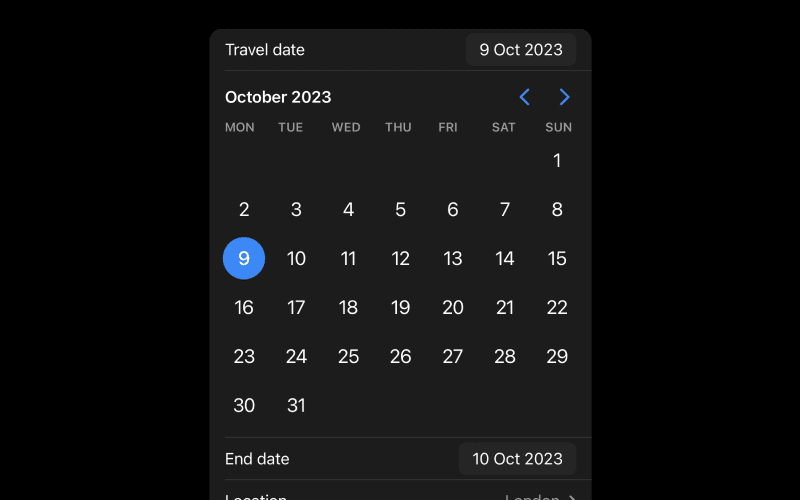

### Props

| Prop name | Type | Default value | Description |
| --------- | ---- | ------------- | ----------- |
| minDate | Date | - | Days before this day will be inactive |
| maxDate | Date | - | Days after this day will be inactive |

### Events

| Event name | Payload | Description |
| ---------- | ------- | ----------- |
| datePick | Date | Fired when some date is selected |

## DatePickerCompact

Date picker compact is a component that displays a date in a compact format.

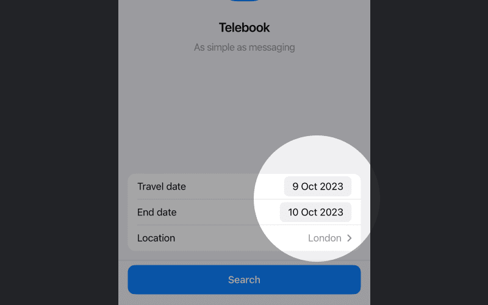

### Props

| Prop name | Type | Default value | Description |
| --------- | ---- | ------------- | ----------- |
| value | Date | - | Visible value |

## Icon

Icon is a component that displays an icon.

### Props

| Prop name | Type | Default value | Description |
| --------- | ---- | ------------- | ----------- |
| name | string | - | Name of the icon |

## Input

Input is a component that allows user to input text.

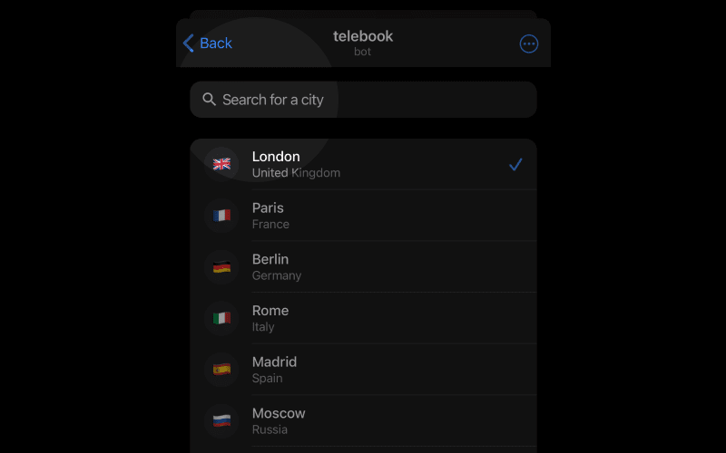

### Props

| Prop name | Type | Default value | Description |
| --------- | ---- | ------------- | ----------- |
| modelValue | string | - | Model value. Will be changed on input |
| placeholder | string | undefined | Text that will be shown when input is empty |
| leftIcon | string | undefined | Name of icon that will be shown on the left side of input |

### Events

| Event name | Payload | Description |
| ---------- | ------- | ----------- |
| update:modelValue | string | Will be emitted when input value is changed |

## List

List is a component that displays a list of items.

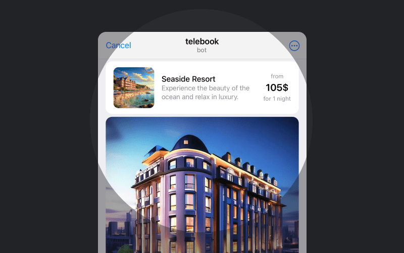

### Props

| Prop name | Type | Default value | Description |
| --------- | ---- | ------------- | ----------- |
| gapped | boolean | - | Whether to add a gap between each item |
| withBackground | boolean | - | Whether to add a background |
| standalone | boolean | - | Whether to display list as a standalone island |

## ListItem

ListItem is a component that displays a list item.

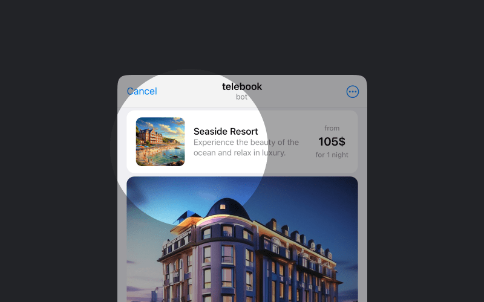

### Props

| Name | Type | Default | Description |
| ---- | ---- | ------- | ----------- |
| avatar | object | - | Avatar object. See [Avatar](#avatar) component for details |
| transactionIcon | string | - | Name of the icon that will be shown instead of avatar |
| icon | string | - | Name of the icon that will be shown instead of avatar |
| title | string | - | Title of the list item. Used along with subtitle |
| subtitle | string | - | Subtitle of the list item |
| label | string | - | Label of the list item |
| rightIcon | string | - | Name of the icon that will be shown on the right side of the list item |
| rightIconLabel | string | - | Label of the right icon |
| standalone | boolean | - | Whether to display list item as a standalone island |
| to | string | - | Router link |
| bigAvatar | boolean | - | Whether to display avatar as a big one |
| nowrap | boolean | - | Whether to display subtitle in one line |

### Slots

| Name | Description |
| ---- | ----------- |
| picture | Picture slot |
| right | Right slot |

## ListCard

ListCard is a component that displays a card with a picture and content below it. The card will be opened with smooth animation just from the list.

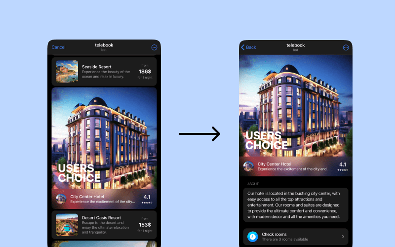

### Props

| Prop name | Type | Default value | Description |
| --------- | ---- | ------------- | ----------- |
| title | string | - | Name of the card |
| picture | string | - | Picture src |
| `pictureThumb` | `string` | `undefined` | Base64 of picture 10x10 used as thumbnail |

### Slots

| Slot name | Description |
| --------- | ----------- |
| visible | Content that will be shown when card is collapsed |
| collapsed | Content that will be shown when card is expanded |

## ListItemExpandable

ListItemExpandable is a component that displays a list item that can be expanded.

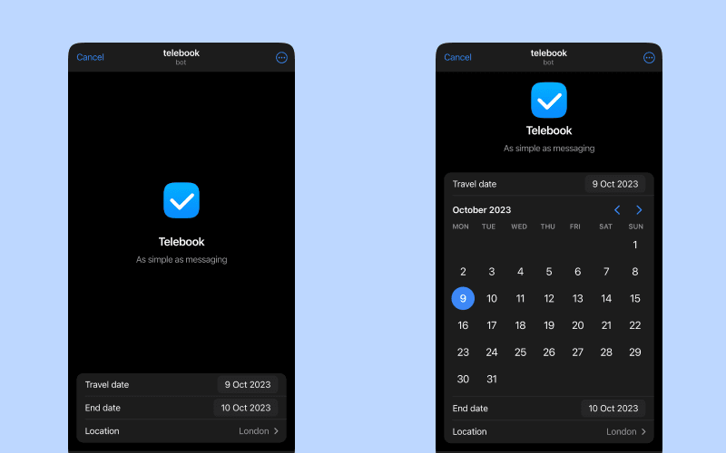

### Props

| Prop name | Type | Default value | Description |
| --------- | ---- | ------------- | ----------- |
| opened | boolean | false | Whether the list item should be opened |

### Slots

| Slot name | Description |
| --------- | ----------- |
| default | Content of the list item |

## ListItemIcon

ListItemIcon is a component that displays an icon inside a list item.

### Props

| Prop name | Type | Default value | Description |
| --------- | ---- | ------------- | ----------- |
| icon | string | - | Icon name |
| type | 'square' \| 'circle' | - | Icon type |

## Lottie

Lottie component allows you to render an animation from a JSON file. You can find more information about Lottie [here](https://airbnb.design/lottie/).

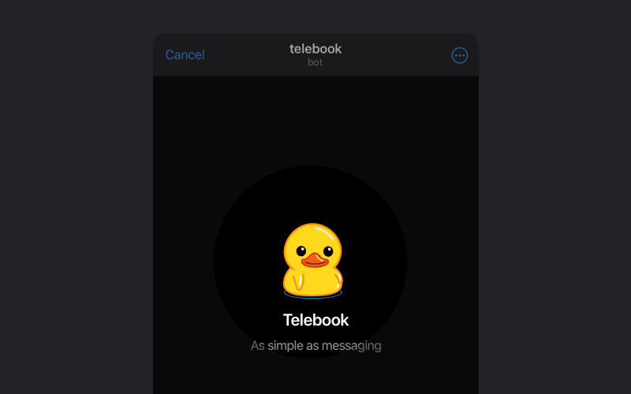

## Props

| Name | Type | Default | Description |
| --- | --- | --- | --- |
| animationData | `object` | `undefined` | The animation data. |
| width | `string` | `undefined` | The width of the animation. |
| height | `string` | `undefined` | The height of the animation. |

## FixedFooter

FixedFooter is a component that displays a footer that is fixed to the bottom of the screen.

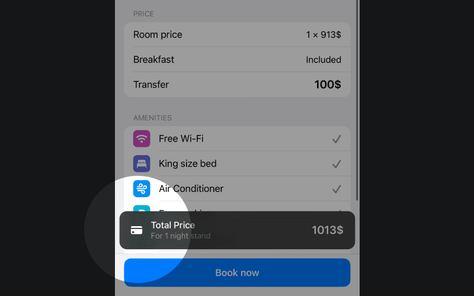

### Props

This component does not have any props.

## PageWithHeader

A component that displays a page with a fixed header and a content.

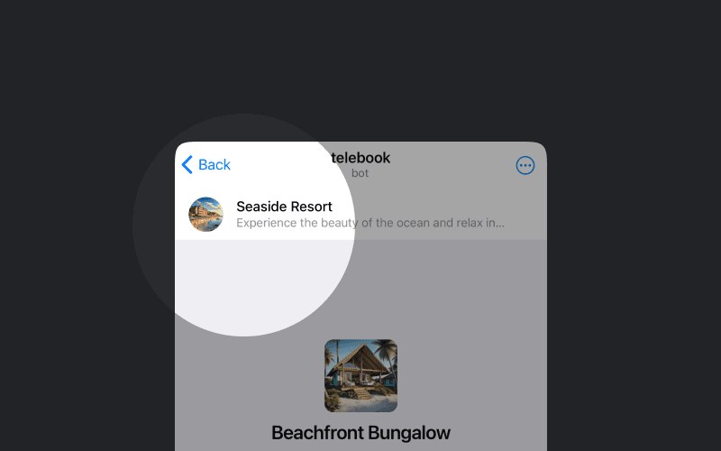

### Props

This component has no props.

## Placeholder

Placeholder is a component that displays a placeholder with a title, caption and a picture.

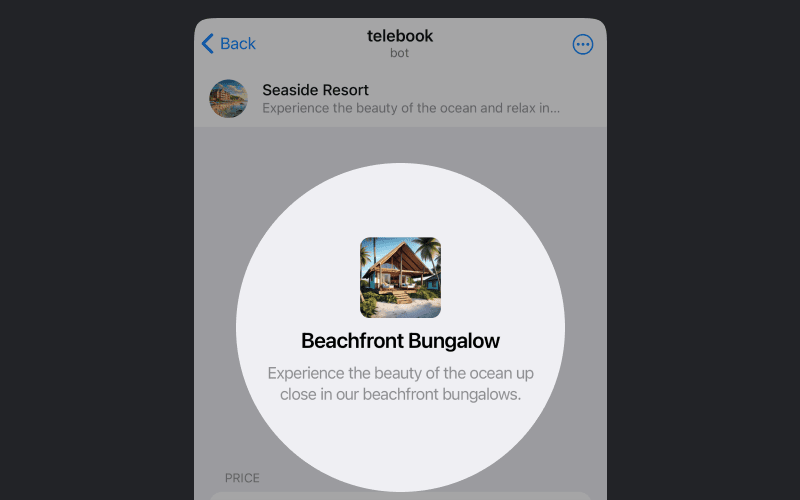

### Props

| Prop name       | Type      | Default | Description                                                                 |
| --------------- | --------- | ------- | --------------------------------------------------------------------------- |
| title           | string    | -       | Title of the placeholder. Will be displayed in a large font below the picture. |
| caption         | string    | -       | Caption of the placeholder. Will be displayed in a smaller font below the title. |
| linkText        | string    | -       | Link text of CTA link |
| compact         | boolean   | -       | Whether the placeholder should be compact |
| withBackground  | boolean   | -       | Whether the placeholder should have a background |

### Slots

| Slot name       | Description                                                                 |
| --------------- | --------------------------------------------------------------------------- |
| picture         | Picture of the placeholder. Will be displayed in the center of the placeholder. |

## Rating

Rating is a component that displays a rating.

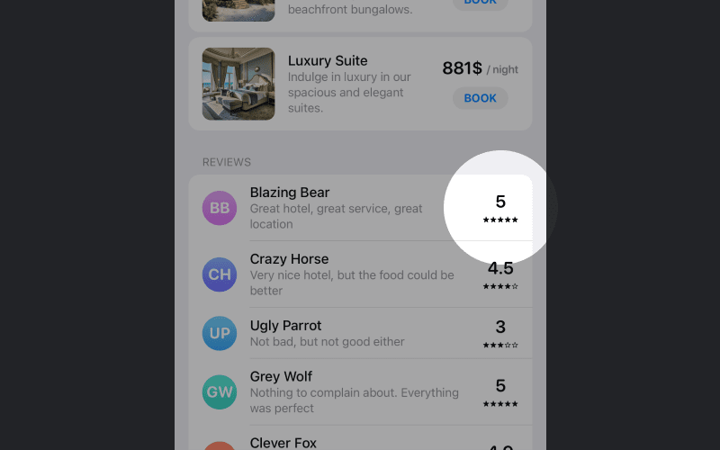

### Props

| Name | Type | Description |
| --- | --- | --- |
| value | number | Rating value 0 — 5 |

## Section

Section is a component that displays a section of content.

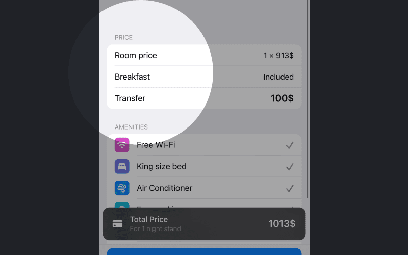

### Props

| Prop name | Type | Default | Description |
| --------- | ---- | ------- | ----------- |
| withBackground | Boolean | false | Adds background color |
| padded | Boolean | false | Adds horizontal paddings |
| standalone | Boolean | false | Whether to display list as a standalone island |
| title | String | undefined | Section title will be placed above the content |

### Slots

| Slot name | Description |
| --------- | ----------- |
| default | Section content |

## Sections

Sections is a component that displays a list of sections.

### Props

This component has no props.

## Text

Text block is a component that displays a text block with a background.

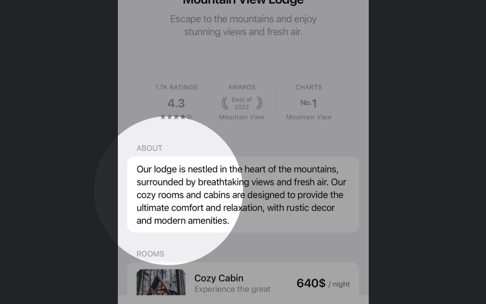

### Props

This component does not have any props.

### Slots

| Name | Description |
| --- | --- |
| default | Text block content |
