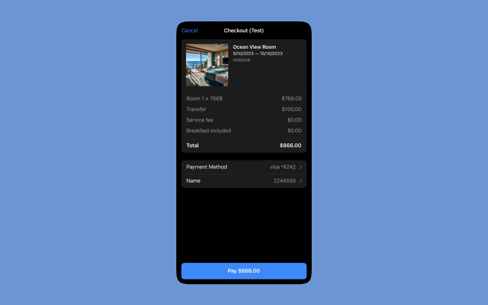

# Telegram Mini App Payments

This guide contains information about how to implement payments in your Telegram Mini App

### How to create receive "payment_token"

1. Open BotFather and call `/mybots`
2. From the menu select your bot
3. From the Inline Keyboard press Settings -> Payments
4. Select "Stripe test" system
5. Open Stripe bot and follow instructions
6. When you will be asking to create a Stripe test account, follow the [Testing Stripe Connect](https://stripe.com/docs/connect/testing#account-numbers) guide
7. After you create the Stirpe account, you will receive the "payment_token" from BotFather

### How to use payments in this example

When receiving the Payment Token, put at the `server/.env` to the `PROVIDER_TOKEN` variable.

Then you'll be able to make test payments

### How to make test payments

When you're testing payments using Stripe Test Account, you can enter a `4242 4242 4242 4242` card number, any future expiration date and random CVC.

Stripe also have other test card numbers allowing to test different cases (success, failure, etc). Read more at Stripe docs:

- [Stripe Test Mode](https://stripe.com/docs/test-mode) — how get test account, keys, cards numbers etc
- [Stripe Testing](https://stripe.com/docs/testing) — detailed guide how to simulate transactions

